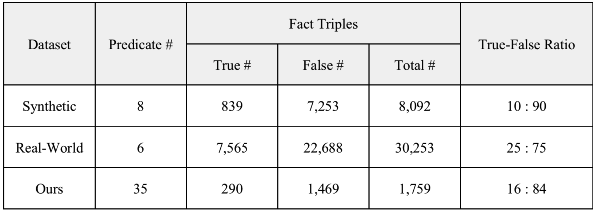

# KV-eval-dataset

This repository provides the two publicly available datasets as well as our dataset for evaluating the fact checking capability in a knowledge graph.

## Publicly available datasets

**The Synthetic dataset (synt.tsv)** contains a set of [English DBpedia](https://wiki.dbpedia.org/develop/datasets/downloads-2016-10)-style triples that comprises true triples manually extracted from Wikipedia tables, and false triples automatically generated by negative sampling.

```
Maryon_Lane	birthPlace	Natal_Province	o
Maryon_Lane	birthPlace	Cyprus	x
Claire_Loewenfeld	birthPlace	Berlin	o
Claire_Loewenfeld	birthPlace	Buckinghamshire	x
James_Boughtwood_Comber	birthPlace	Garlieston	o
James_Boughtwood_Comber	birthPlace	Southampton	x
Elisabeth_Alida_Haanen	birthPlace	Utrecht	o
Elisabeth_Alida_Haanen	birthPlace	Amsterdam	x
Philippe_Mouskes	birthPlace	Ghent	o
Philippe_Mouskes	birthPlace	Tournai	x
...
```

**The Real-World dataset (real.tsv)** derived from [Google Relation Extraction Corpora](https://ai.googleblog.com/2013/04/50000-lessons-on-how-to-read-relation.html/) and [WSDM Cup Triple Scoring Challenge](https://www.wsdm-cup-2017.org/triple-scoring.html/), which contains a set of English DBpedia-style triples that comprises true triples manually extracted from Wikipedia texts by crowdsourcing, and false triples automatically generated by negative sampling.

```
Alanis_Morissette	nationality	Canada	o
Alanis_Morissette	nationality	United_Kingdom	x
Alanis_Morissette	nationality	Italy	x
Alanis_Morissette	nationality	Nigeria	x
Albert_Einstein	nationality	Germany	o
Albert_Einstein	nationality	Scotland	x
Albert_Einstein	nationality	Venezuela	x
Albert_Einstein	nationality	Iran	x
Alfred_Hitchcock	nationality	United_Kingdom	o
Alfred_Hitchcock	nationality	Sri_Lanka	x
...
```

## Issues in the publicly available datasets

**1. False triples in these datasets are automatically generated by negative sampling.**

Therefore, these datasets contain false-labeled true triples (false negatives) that is probable to make an evaluation inaccurate. 

According to our analysis, at least 4% of false triples in these datasets are false negatives.

**2. Some true triples in these datasets are already contained in the existing knowledge graph, English DBpedia.**

This means that some test cases in these datasets can be easily solved by checking whether a given triple is contained in a knowledge graph or not.

According to our analysis, 77.26% of the Synthetic dataset and 8.58% of the Real-World dataset are already contained in the knowledge graph, English DBpedia.

## Our dataset

**Our dataset (ours.tsv)** is constructed by manually labeling true or false labels on the [K-Box](http://kbox.kaist.ac.kr)-style triples extracted from Wikipedia texts by the state-of-the-art [BERT-based relation extractor](https://github.com/machinereading/bert-ko-re/).

```
Every_Heart_-민나노키모치-	artist	보아	o
GO_GO_서머!	artist	카라_(음악_그룹)	o
Over_the_Rainbow	artist	장진영	x
THE_맨파워!!!	artist	모닝구무스메	o
내_손을_잡아_(노래)	artist	아이유	o
눈동자의_멜로디	artist	보이프렌드_(음악_그룹)	o
다시_만난_세계	artist	소녀시대	o
디라이토_(대성의_음반)	artist	빅뱅_(음악_그룹)	x
라이징_스타	artist	타이미	o
러브_네버_다이즈	artist	팬텀_(음악_그룹)	x
...
```

Our dataset is constructed to solve the afore-mentioned issues in the two ways:
* **False triples are manually checked to prevent false negatives.** Specifically, we labeled a given triple as false if there is no Wikipedia article that contains a sentence supporting that the given triple is true.
* **True triples are included in our dataset only if the given triple is not contained in the knowledge graph, K-Box.**

These makes our dataset more reasonable and challenging to evaluate the fact checking capability on newly found triples missing in a knowledge graph than the publicly available datasets. 

## Statistics

The statistics of all the datasets in this repository are as follows:



## Licenses
* `CC BY-NC-SA` [Attribution-NonCommercial-ShareAlike](https://creativecommons.org/licenses/by-nc-sa/2.0/)
* If you want to commercialize this resource, [please contact to us](http://mrlab.kaist.ac.kr/contact)

## Publisher
[Machine Reading Lab](http://mrlab.kaist.ac.kr/) @ KAIST

## Contact
Jiseong Kim. `jiseong@kaist.ac.kr`, `jiseong@gmail.com`

## Acknowledgement
This work was supported by Institute of Information & Communications Technology Planning & Evaluation(IITP) grant funded by the Korea government(MSIT) (2013-2-00109, WiseKB: Big data based self-evolving knowledge base and reasoning platform).